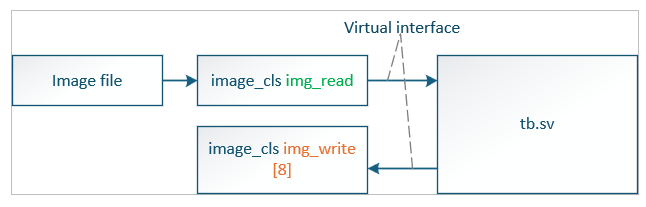
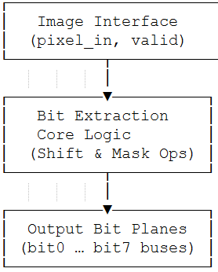
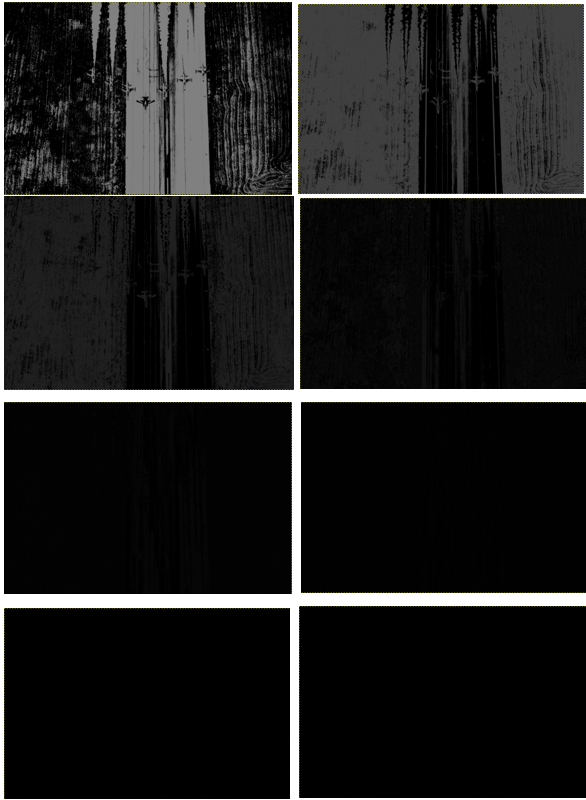

# The FPGA version using SystemVerilog.

## Architecture

1. Each input pixel (8-bit grayscale) is streamed into the FPGA.

2. The design extracts 8 individual bit planes in parallel using bit masking (&) and shifting (>>).

3. The result can be visualised as 8 binary images, each showing details of a specific significance level.

## Simulation and Verification

The design was simulated with behavioural models to verify:

* Bit-plane accuracy against MATLAB reference

* Correct reconstruction of the original pixel from bit planes

## Verification Flow

1. MATLAB script generates reference bit-plane data.

2. FPGA testbench (tb_image_cls.sv) loads the same pixel stream.

3. Comparison is made between MATLAB and FPGA outputs (byte-accurate).

## Tools Used

- MATLAB — Algorithm reference & validation

- Questasim — Simulation

- SystemVerilog  

- GitHub — Documentation and version tracking

## FPGA RESULTS USING SYSTEMVERILOG

**Author** 
> - Fatih ILIG
> - Senior FPGA Engineer
> - Rochester, Kent, UK
> - [LinkedIn](https://www.linkedin.com/in/fatih-ili%C4%9F-48775460/)
