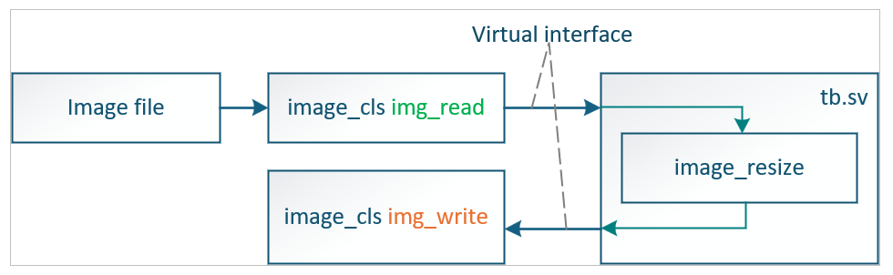
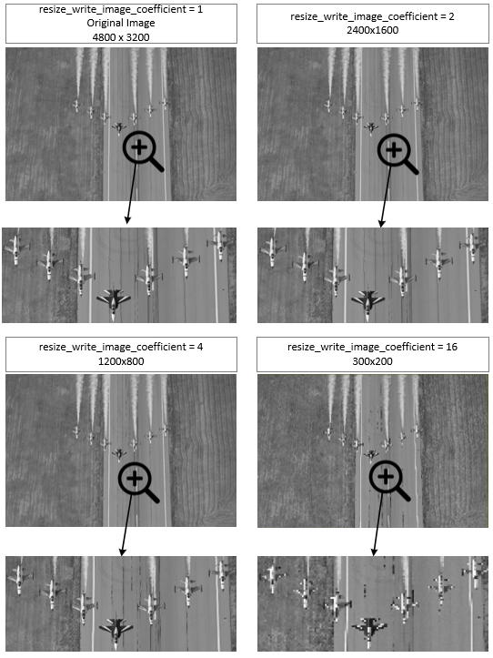

# 🖼️ Image Resize Module (SystemVerilog)

## 📘 Overview
This project demonstrates an **image resizing module** written in **SystemVerilog**.  
The design receives an image stream through a simple interface (`image_if`) 
and produces a resized version of the image by **reducing its resolution** by a configurable factor.  

---

## 🧩 Project Structure

```
├── hdl/image_if.sv        # Image interface definition
├── hdl/image_resize.sv    # Image resizing module
```

---

## ⚙️ Files Description

### **1. image_if.sv**
A reusable interface that defines the signal structure for image data communication between modules.

**Key Features:**
- Parameterizable data width (`DATA_WIDTH`)
- Clock input for synchronous data transfer
- Standardized signals:
  - `payload` — Pixel data
  - `data_valid` — Valid pixel indicator
  - `sof` — Start of frame
  - `eof` — End of frame

**Example:**
```systemverilog
image_if #(.DATA_WIDTH(8)) img_in_if (.clk(clk));
```

---

### **2. image_resize.sv**
The main logic module that performs **image downscaling**.

**Parameters:**
- `resize_option` — Resize ratio (e.g., `2` means output is half resolution)
- `input_image_resolution_width` — Defines input image width in pixels

**Functionality:**
- The module samples incoming pixels and selectively forwards them to the output interface.
- It effectively **reduces horizontal and vertical resolution** by skipping pixels and lines based on the resize factor.
- Includes internal counters to manage:
  - **Horizontal pixel selection**
  - **Vertical line selection**
  - **Start-of-line detection (SOL)**
- The design is **synchronous**, using `clk` from the input interface and reset (`rst_i`).

**Example:**
If `resize_option = 2`:
- Input image = `400 × 400`
- Output image = `200 × 200`

**Interface Connections:**
```systemverilog
image_resize #(
    .resize_option(2),
    .input_image_resolution_width(4800)
) u_image_resize (
    .rst_i(rst),
    .image_if_i(input_if),
    .image_if_o(output_if)
);
```

---

## 🧠 How It Works

1. **Input Data Stream:**  
   Each incoming pixel is received on the `image_if_i` interface with `data_valid` asserted.

2. **Line Detection:**  
   The module tracks when a new line starts using a counter and a derived signal (`sol`).

3. **Horizontal and Vertical Counters:**  
   - `cnt_horizontal` increments for each valid pixel.  
   - `cnt_vertical` increments at each start of line.

4. **Resizing Logic:**  
   Only when both counters reach the resize selection condition (e.g., every 2nd pixel, every 2nd line), the pixel is forwarded to the output.

5. **Output Data Stream:**  
   The resized pixel stream is transmitted via `image_if_o`.

## 🧩 Architecture


---

## FPGA RESULTS USING SYSTEMVERILOG

Images : 🔗 [Turkish Aerospace Industries](https://www.tusas.com/medya-merkezi/fotograf-galerisi)

## 🧪 Simulation

### Requirements
- ModelSim / QuestaSim / Vivado Simulator  
- SystemVerilog 

---

## 🧑‍💻 Author
> - Fatih ILIG
> - 📅 *Created on:* 30 October 2025  
> - Senior FPGA Engineer
> - 🔧 *Language:* SystemVerilog 
> - 🏗️ *Category:* Image Processing / Hardware Design
> - 📍 Rochester, Kent, UK
> - 🔗 [LinkedIn](https://www.linkedin.com/in/fatih-ili%C4%9F-48775460/)
