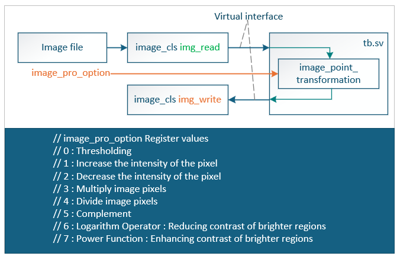
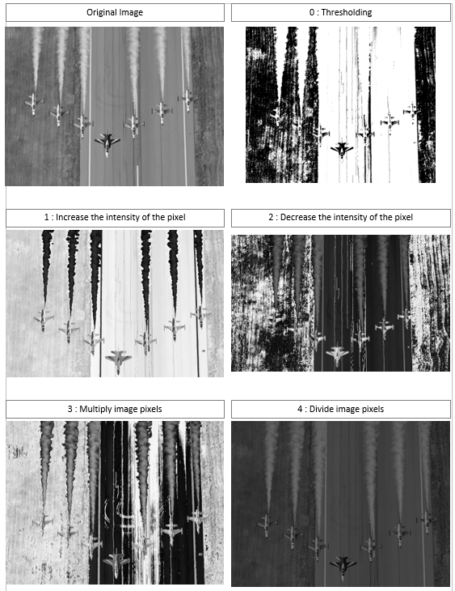
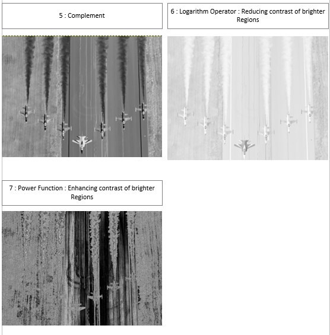

# 🖼️ Point Transformations (SystemVerilog)

## 🧩 Architecture

---

## FPGA RESULTS USING SYSTEMVERILOG

---
Images : 🔗 [Turkish Aerospace Industries](https://www.tusas.com/medya-merkezi/fotograf-galerisi)

### Requirements
- ModelSim / QuestaSim / Vivado Simulator  
- SystemVerilog 

---

## 🧑‍💻 Author
> - Fatih ILIG
> - 📅 *Created on:* 04 November 2025  
> - Senior FPGA Engineer
> - 🔧 *Language:* SystemVerilog 
> - 🏗️ *Category:* Image Processing / Hardware Design
> - 📍 Rochester, Kent, UK
> - 🔗 [LinkedIn](https://www.linkedin.com/in/fatih-ili%C4%9F-48775460/)
