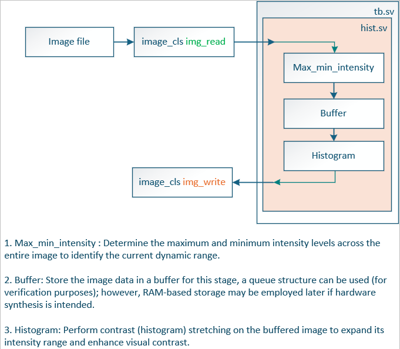
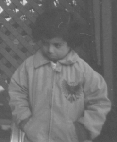
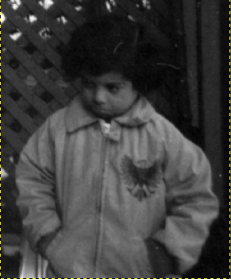

# Histogram Contrast Stretching (SystemVerilog)

## Architecture

---

## FPGA RESULTS USING SYSTEMVERILOG
### OriginalImage

### FPGA result

---

### Requirements
- ModelSim / QuestaSim / Vivado Simulator  
- SystemVerilog 

---

## Author
> - Fatih ILIG
> - *Created on:* 04 November 2025  
> - Senior FPGA Engineer
> - *Language:* SystemVerilog 
> - *Category:* Image Processing / Hardware Design
> - Rochester, Kent, UK
> - [LinkedIn](https://www.linkedin.com/in/fatih-ili%C4%9F-48775460/)
