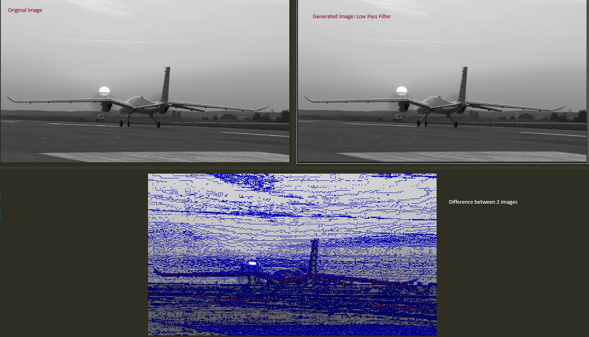
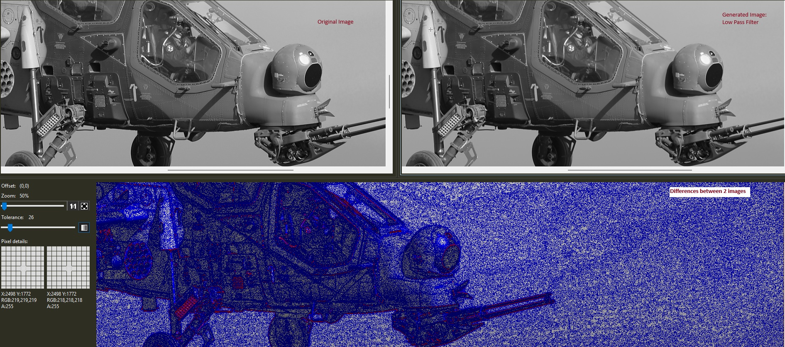
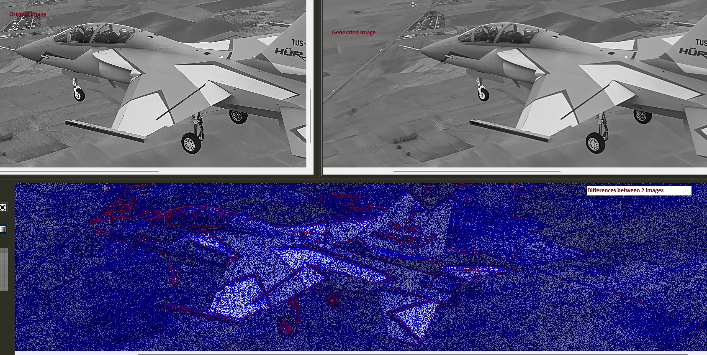
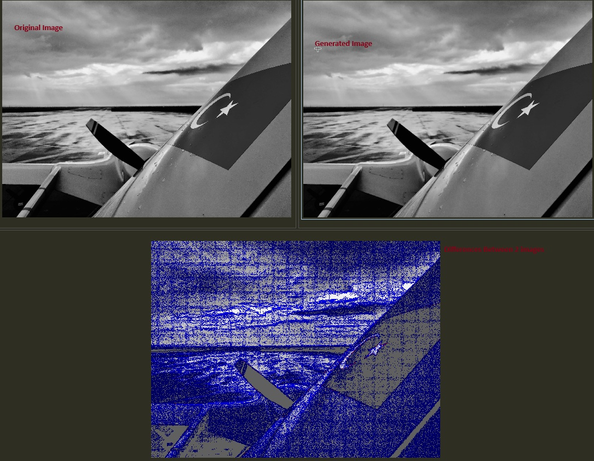

# Low Pass Filter (SystemVerilog)
## Overview
Low Pass Filter
•	Low pass filters block high frequency content of the image
•	High frequency content correspond to boundaries of the object.
Noise Removal
•	To remove speckles/dots on an image
•	Dots can be modeled as impulses or continuously varying (Gaussian noise)
•	Can be removed by taking mean or median values of neighboring pixels (e.g 3x3 window)
•	Equivalent to low pass filtering
Problem with low pass filtering
•	May blur edges
•	More advanced techniques: adaptive, edge preserving

Median Filter
•	Median filter replaces the pixel at the center of the filter with the median value of the pixels falling beneath the mask.
•	Median filter does not blur the image but it rounds the corners

---

## Project Structure

```
├── hdl/low_pass_filter.sv        
├── hdl/low_pass_filter_pkg.sv    
```

---

## FPGA RESULTS USING SYSTEMVERILOG

### FPGA result 1



### FPGA result 2



### FPGA result 3



### FPGA result 4



---

### Requirements
- ModelSim / QuestaSim / Vivado Simulator  
- SystemVerilog 

---

## Author
> - Fatih ILIG
> - *Created on:* 16 November 2025  
> - Senior FPGA Engineer
> - *Language:* SystemVerilog 
> - *Category:* Image Processing / Hardware Design
> - Rochester, Kent, UK
> - [LinkedIn](https://www.linkedin.com/in/fatih-ili%C4%9F-48775460/)
