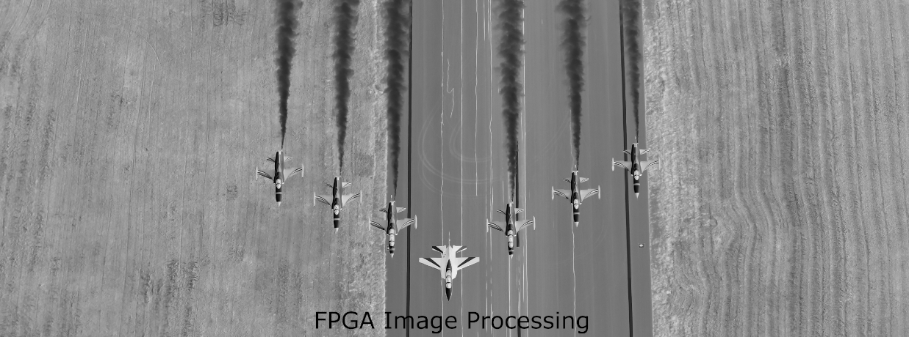

# FPGA-Based Image Processing Algorithms

This repository contains FPGA implementations of common image processing algorithms developed in MATLAB & FPGA (SystemVerilog).  
Each project includes:
- MATLAB reference implementation (matlab_implementation folder) (Dr. Rashi Agarwal  https://www.youtube.com/playlist?list=PLEo-jHOqGNyUWoCSD3l3V-FjX9PnHvx5n)
- SystemVerilog files 
- FPGA Simulation results (FPGA DESIGN OVERVIEW & RESULTS.md)

## Implemented Algorithms
1. Bit Plane Extraction
2. Resize image
3. Point transformations
4. Histogram Streching
5. Histogram Equalization

Each design is written in SystemVerilog and verified using behavioural simulation on Questasim.

